  <picture>
    <source media="(prefers-color-scheme: dark)" srcset="boot.svg">
    
  </picture>

# hi, i'm Omar 👋

frontend dev @ **Atomtech** · building things on the side, constantly

🇹🇭 bangkok · react/typescript by day, swift & java by necessity

---

### 🔭 currently building

- **Sol** — a macOS menubar AI agent with screen awareness and a panic-stop button. swift + local LLM brain.
- **Blood AI** — my flagship discord bot platform (~13k lines), mid-refactor into a plugin architecture
- **`127.0.0.1:67`** — autonomous sumo robot for a STEM competition. simplicity wins fights.

### 🛠 stack

### 📊 stats

---

🌩 weather radar enjoyer · 📷 photography (irl + in-game) · 🎧 MF DOOM / Radiohead / Chopin

> "the best solution is usually the boring one that works"
