<h1 align="center">Omar</h1>

  Frontend developer at <strong>Atomtech</strong> · building useful things on the side

  <code>Bangkok, Thailand</code> · React & TypeScript by day · Swift & Java when the job calls for it

  

## What I'm shipping

- **Sol** — a macOS menu bar AI agent with screen awareness, a local-LLM brain, and a panic-stop button.
- **Blood AI** — my flagship Discord bot platform, currently moving toward a cleaner plugin architecture.
- **127.0.0.1:67** — an autonomous sumo robot for a STEM competition. Simple, reliable, hard to knock over.

## Toolbox

`React` · `TypeScript` · `Swift` · `Java` · `Spring Boot` · `Python`

I like small interfaces, boring solutions that work, and software that is easy to understand six months later.

## Away from the keyboard

Weather radar enthusiast · photography, both real and in-game · MF DOOM, Radiohead, and Chopin

> The best solution is usually the boring one that works.
